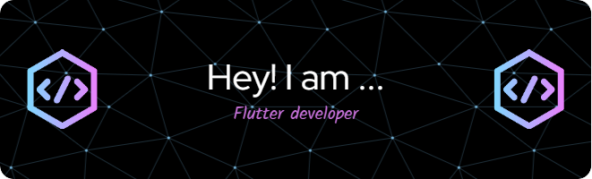

<!--     <h1 align="center"> -->
<!-- </h1> -->
<h1 align="center">I'm Akshar Patel👋
<h3 align="center">A passionate Flutter developer from India</h3>
  

  

<!--  -->

- 🔭 I’m currently working on **Flutter Development**

- 🌱 I’m currently learning **Flutter**

- 👯 I’m looking to collaborate on **Core Flutter**

- 🤝 I’m looking for help with **Best Techers**

- 👨‍💻 All of my projects are available at [https://github.com/Aksharpatel06?tab=repositories](https://github.com/Aksharpatel06?tab=repositories)

- 💬 Ask me about **C, C++, Dart**

- 📫 How to reach me **aksharpatel030306@gmail.com**

- 📄 Know about my experiences [https://github.com/Aksharpatel06](https://github.com/Aksharpatel06)

- ⚡ Fun fact **I am Funny 😅**

<h3 align="left">Languages and Tools:</h3>

     <a href="https://www.figma.com/" target="_blank" rel="noreferrer">   

<!--    -->
<!--    -->

  
 
  
<h2>🏆GitHub Award</h2>

  

    <a href="https://github.com/DenverCoder1/github-readme-streak-stats">
      
  

    </a>
  

  

 
  
<h2>📊 Stats and Activity</h2>

  <h3>🔥 Streak Stats</h3>

  <!-- GitHub Readme Streak Stats - https://github.com/DenverCoder1/github-readme-streak-stats -->
  

    <a href="https://github.com/DenverCoder1/github-readme-streak-stats">
      

       
&nbsp;&nbsp;

      
&nbsp;&nbsp;

    </a>
<!--     
🔥 Get streak stats for your profile at <a href="https://git.io/streak-stats">git.io/streak-stats</a>
 -->
  

